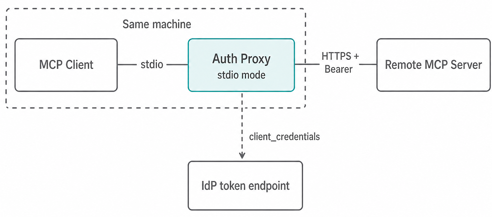
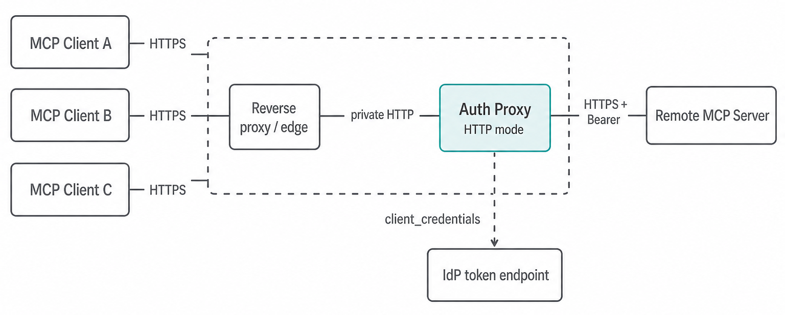

# Authenticated Machine-to-machine MCP without the OAuth puzzle

[MCP Authorization spec](https://modelcontextprotocol.io/specification/2025-11-25/basic/authorization) and most MCP clients assume a human is present: open a browser, consent, get a token, keep going until the session expires, then repeat. That model breaks as soon as you want an autonomous agent, a CI job, a daemon, or any other long-running process that must talk to an OAuth-protected MCP server with nobody at the keyboard.

**[mcp-client-credentials-auth](https://github.com/velias/mcp-client-credentials-auth)** is a local MCP authentication proxy for that gap. It sits between your MCP client and a remote MCP server, obtains tokens with the OAuth `client_credentials` grant ([MCP OAuth Client Credentials extension](https://modelcontextprotocol.io/extensions/auth/oauth-client-credentials) Draft), and forwards MCP traffic with a Bearer token. Your MCP client keeps talking plain unauthenticated MCP, and the proxy handles authentication.

This post is for two audiences: people who need machine access to a remote MCP server today, and MCP server providers who want a ready client path to recommend for that access.

To use it, the MCP server provider must support machine auth via OAuth [`client_credentials`](https://datatracker.ietf.org/doc/html/rfc6749#section-4.4). In practice that means a service account (sometimes labeled "API key", "machine-to-machine application", or similar) with a `client_id` and `client_secret` that their OAuth setup accepts for this grant. Creating those credentials is often self-service in the provider's account or developer portal, or they are handed out on request. Interactive-only servers (browser login / user consent only) are out of scope for this proxy.

## The use case

Use it whenever the caller is a machine, not a person, **and** the remote MCP provider offers that service-account style access:

- Autonomous agents and background workers that need tools, resources, or prompts from a protected remote MCP
- CI/CD pipelines and ops automations
- Server-to-server integrations and long-running processes where human may not be at the keyboard

You can also use it when you are tired of unoptimal interactive authentication UX in MCP clients, when you can easily miss that MCP server is not authenticated, and you do not have access to the tools anymore.

Once you have credentials from the provider, point the proxy at the remote MCP URL and drop it into your MCP client config. The proxy acquires acsess tokens, refreshes them proactively, reconnects when the remote MCP server flaps, and stays transparent to the protocol.

## Installation that stays simple (because discovery works)

Well-behaved MCP servers publish [MCP Authorization](https://modelcontextprotocol.io/specification/2025-11-05/basic/authorization) metadata (RFC 9728 / RFC 8414). The proxy follows that discovery path, so you normally do **not** hand-configure a token endpoint or invent scopes.

Typical setup in an MCP client such as Cursor or Claude Code is three environment variables:

```jsonc
{
  "mcpServers": {
    "my-remote-server": {
      "command": "npx",
      "args": ["-y", "mcp-client-credentials-auth"],
      "env": {
        "MCP_CC_PROXY_REMOTE_MCP_URL": "https://mcp.example.com/mcp",
        "MCP_CC_PROXY_CLIENT_ID": "my-service",
        "MCP_CC_PROXY_CLIENT_SECRET": "s3cr3t"
      }
    }
  }
}
```

That is the whole install for the common path: remote MCP server URL + `client_id` + `client_secret`. Discovery finds the IdP token endpoint and the baseline scopes. The proxy fails closed at startup if auth or the remote cannot be made ready, so you do not get a green local session that dies on the first real call.

`npx` downloads and runs the published package on your machine, so use trusted packages only (same caution as any other `npx` MCP server).

If a server accepts Bearer tokens but does not publish discovery, you can still run with a manual token endpoint and scopes (`MCP_CC_PROXY_TOKEN_ENDPOINT` and usually `MCP_CC_PROXY_SCOPES`). Those values must come from the MCP server provider's documentation, do not try to invent them. Prefer auto-discovery when the MCP server supports it.

## Two deployment options

### 1. Local stdio (default): one client, one proxy process



This is the install path above. Your MCP client spawns the proxy over stdio (proxy acts as local MCP Server) on the same machine, and the proxy talks outbound HTTPS to the remote server with Bearer auth. Each user (or agent host) should use their own service-account credentials, not a shared org-wide secret copied into every laptop config.

**Viable when:**

- A single MCP client (IDE, agent host, CLI) can spawn a local MCP Server process
- Each user can obtain (or be issued) their own `client_credentials` client
- You want the smallest attack surface: no local network listener
- Credentials stay on that machine / in that client's secret store

Prefer stdio whenever one client can own the proxy lifecycle. It is the right default for Cursor, Claude Desktop, Claude Code, and similar local setups.

### 2. On-premises HTTP: one shared proxy for several clients



Set `MCP_CC_PROXY_TRANSPORT=http`. The process listens for Streamable HTTP so multiple MCP clients on a private network can share one outbound `client_credentials` identity. A container image is also available with HTTP as the default transport and k8s style health checks for easy deployment.

**Viable when:**

- Several MCP clients on a trusted private network should share one machine identity
- You do not want to install or spawn the proxy on every workstation
- A single MCP client (IDE, agent host, CLI) can't spawn a local MCP Server process but has to use remote one

HTTP mode has no TLS or inbound authentication on the proxy itself, see [Security considerations](#security-considerations).

| Situation | Choose |
|-----------|--------|
| One client can spawn a local MCP server process, and each user has their own OAuth client | **Local stdio** |
| Many clients or no local MCP Server support, one shared M2M identity on a private network | **On-premises HTTP** |
| Public internet or untrusted callers | **Not recommended** for either mode |

## What you get beyond "it connects"

- Transparent bidirectional MCP forwarding
- Identity and capability forwarding (your client sees the remote server's real name and capabilities, including server-to-client features such as sampling and elicitation)
- Proactive access token refresh and 401 retry behavior
- [Scope step-up](https://modelcontextprotocol.io/specification/2025-11-25/basic/authorization#step-up-authorization-flow) when the remote challenges with 403 `insufficient_scope`
- Streamable HTTP with SSE fallback for connection-class failures
- Automatic reconnection and stale remote session recovery
- Optional call audit log (on by default in HTTP mode)
- Categorized errors (`authentication` / `connection` / `remote`) with detailed messages for easier troubleshooting
- Fail-closed startup: the local transport binds only after auth is ready and the remote MCP server is reachable, so your MCP client shows a correct status

## Security considerations

A few rules of thumb matter more than the feature list:

- **Treat the service account as powerful.** Whoever holds `client_id` / `client_secret` (or can reach an HTTP-mode proxy that already has them) gets that remote privilege. Prefer per-user clients for stdio, and rotate on compromise.
- **Prefer vaults over plain-text MCP config.** The install snippet above shows secrets in environment variables for brevity. In production, inject `client_id` / `client_secret` at launch from 1Password, Bitwarden, a cloud secret store, or similar, instead of leaving them in an MCP config file on disk.
- **Keep the proxy private.** Stdio has no network listener. HTTP mode is for trusted private networks only: recommended to terminate TLS and inbound auth at a reverse proxy, ingress, or MCP gateway. Never publish the listener to the public internet.
- **HTTP mode is one shared machine identity.** All MCP clients reuse the same outbound Bearer token and scopes. It is not a multi-tenant edge, so use separate deployments per trust boundary.
- **The proxy owns the outbound Authorization header.** Access tokens stay in memory and are never logged, and the local MCP client cannot supply or override the Bearer token used toward the remote server.

More detail is in the repo [Security](https://github.com/velias/mcp-client-credentials-auth#security) section.

## For MCP server providers

If you already protect your MCP server with OAuth for interactive clients, your users will still ask how agents, CI, and other headless callers should authenticate. You do not need to ship a custom M2M client for every IDE and agent host. Document this proxy as the supported way to get service-account access: users create (or receive) a `client_id` / `client_secret`, point the proxy at your MCP URL, and keep using their existing plain MCP client.

That works best when your product already exposes machine credentials and standard MCP Authorization discovery:

- Publish protected resource / authorization server metadata so the proxy can find your token endpoint and baseline scopes
- Offer a service account (or equivalent) granted those baseline scopes for `client_credentials`
- Prefer a short setup guide: remote URL + credentials (+ this proxy), not a DIY OAuth client walkthrough

Users then get secure, long-term, non-interactive service-account access without building token acquisition themselves. You keep one OAuth-protected MCP surface for both human consent flows and machine callers, and you point the machine path at a known, discovery-friendly client instead of fragmented one-off scripts.

If discovery is not available yet, you can still recommend the proxy, but document the necessary settings yourself: the IdP token endpoint URL and the scopes to request (`MCP_CC_PROXY_TOKEN_ENDPOINT` and `MCP_CC_PROXY_SCOPES`). Users cannot discover those without your guidance. Auto-discovery remains the smoother story when you can publish it.

For more detail see [notes for MCP Server Developers](https://github.com/velias/mcp-client-credentials-auth#notes-for-mcp-server-developers)

## Links

- GitHub: [velias/mcp-client-credentials-auth](https://github.com/velias/mcp-client-credentials-auth)
- npm: [mcp-client-credentials-auth](https://www.npmjs.com/package/mcp-client-credentials-auth)
- Container: `ghcr.io/velias/mcp-client-credentials-auth`
- Spec: [MCP Authorization](https://modelcontextprotocol.io/specification/2025-11-25/basic/authorization)
- Spec: [MCP OAuth Client Credentials](https://modelcontextprotocol.io/extensions/auth/oauth-client-credentials)

## Conclusion

If you run OAuth-protected MCP for agents or pipelines, or you operate an MCP server and want an easy M2M client path for your users, start with discovery plus service-account credentials and let the proxy handle the rest on the client side. Feedback and issues are welcome on the repo.
